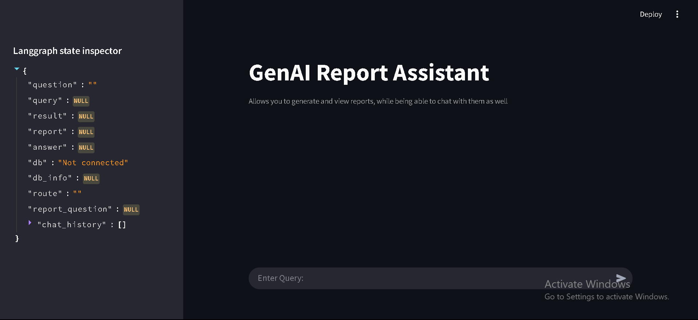

# 🤖 Military Report Generation ChatBot
Allows users to communicate with databases in natural language, to get detailed reports and analysis as per their requests.

Created for WESEE, MoD.

---
## 📦 Respository
Clone the deployment ready project
```
git clone https://github.com/Eros483/Maritime-Report-Generation
cd Maritime-Report-Generation
```
---
## ⚙️ Environment Setup
1. We recommend using Anaconda for environment control.
2. Create the environment using the provided yml, and activate it.
    - Take care to remove llama-cpp-python from the yml
```
conda env create -f environment.yml
conda activate rag_new_env
```
3. To install llama-cpp-python:
```
call "C:\Program Files\Microsoft Visual Studio\2022\Community\VC\Auxiliary\Build\vcvars64.bat"
where cl
where cmake
set CMAKE_ARGS=-DGGML_CUDA=ON
set FORCE_CMAKE=1
pip install llama-cpp-python --no-cache-dir --verbose
```
---
## 🚀 Running the Frontend
```
streamlit run frontend.py
```
## 🛠️ Frontend Preview

---
## 💡 Project Structure
```
Maritime-Report-Generation
│   .gitignore
│   environment.yml
│   frontend.py
│   preview.png
│   README.md
│   requirements.txt
│
├───backend
│       functions.py
│       main.py
│
├───datasets
│       data.csv
│       data_processed.csv
│       REDACTED.csv
│       india_eez.json
│
├───MCP
│   │   client.py
│   │   config.json
│   │   frontend.py
│   │   mcp_state.json
│   │   state_manager.py
│   │
│   ├───analysis_server
│   │       server.py
│   │
│   ├───elaboration_server
│   │       server.py
│   │
│   └───report_generation_server
│           server.py
│
├───models
│       dolphin3.0-llama3.2-3b-q5_k_m.gguf
│
├───notebooks
│       csv_to_sql_conversion.ipynb
│       data_processing.ipynb
│       generated_report.pdf
│       myDataBase.db
│       sql_communication.ipynb
│
└───sql_files
        myDataBase.db
```
---
## 🧑🏻‍💻 Working Explaination
#### Objective: Existing Information Analysis and Reports are generated through manually parsing data for required fields, and then analysed by field experts, wasting precious time that can be automated.

#### Solution:
1. Using local llms via llama-cpp-python and Ollama to act as the brain for this agentic AI endeavour.
2. Parsed CSV data, preprocessing it and adding extra attributes as deemed necessary. Done in `notebooks/data_processing.ipynb`.
3. Utilised `sqlalchemy` to push csv data to `.db` sqlite files. Done in `notebooks/csv_to_sql_processing.ipynb`.
4. Prototyped  the following features in `notebooks/sql_communication.iynb`, and encapsulated them in `backend/functions.py`.
    - `load_model`: loads LLM Llama 3.2 using llama-cpp-python.
    - `write_sql_query`: Converts natural language query into sql queries.
        - Utilised the AUTOMAT framework for prompt engineering, along with existing prompts at LangChain.
        - Faced issues with llm output formatting,and table name hallucinations. 
    - `execute_query`: Executes created SQL query with Querying tool from langchain_community.
    - `report_generation`: Uses information released by `execute_query` to find significant patterns, identifies anomalies, and generates a report in a pre-dictated format, in markdown.
    - `elaborate_on_response` : Uses information released by `execute_query` and the report generated by `report_generation` to focus on a singular aspect as requested by user.
5. The next step was to combine all these methods into a single pipeline, for which two methods were devised:
    - LLM powered routing, based on user queries.
    - MCP architecture, employing agentic AI via OLlama LLM.
---
## 🔀LLM powered Routing
1. Created nodes containing all the feature functions with edges, using LangGraph, and a globally used `state` via a typedDict configuration, and connected them using langgraph edges.
2. Added a conditional edge based on a function `router`:
    - `router`: Decides whether the user query was a report request, an analysis request or a general request, and routes nodes accordingly.
3. Pipeline contained in `backend` directory, with `frontend.py` being used as a frontend for accessing it.

**Drawback**: As `router` is LLM driven, might not work accurately for higher complexity queries, uneccesarily employing extra resources.

---
## 🏛️ MCP Architecture
1. Created a client-server architecture based on MCP concepts.
2. Created multple servers housing the feature functions, with `state_manager.py` handling global data storage in `mcp_state.json`.
3. Created `client.py` which connects to all the servers, based on the contents of `config.json`. 
4. Pipeline accessible in `MCP` directory, with `frontend.py` providing usability.

**Drawback**: As MCP employes Agentic AI, the formatted reports received from functions, ceased to be the final output, and instead a LLM interpretation from the generated report became the receive output.

---
## 🏆 Final Usage:
Due to lower inference time and superior performance, the manual routing logic pipeline was chosen over the MCP architecture for final usage.

---